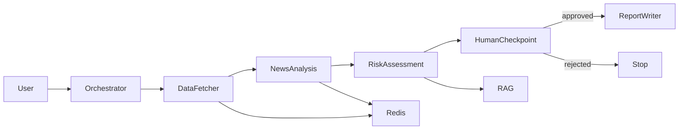

# Module 6 Report - Multi-Agent Research

The backend defines typed messages, five typed tools, one-hour Redis/in-memory
TTL caching, structured JSON call logs, 30-second request timeouts, three
attempts with exponential backoff, and an explicit API confirmation checkpoint.

Before submission, replace provider fallbacks with the Module 3 FinBERT model,
run AAPL/MSFT/TSLA (or three documented tickers), save full reports and timing,
identify the bottleneck, and report the parallel plan. The current sequential
order is intentionally observable but stock-data and news calls can run in
parallel before risk synthesis.

Base image: `python:3.11.9-slim-bookworm`. Record measured image size.
