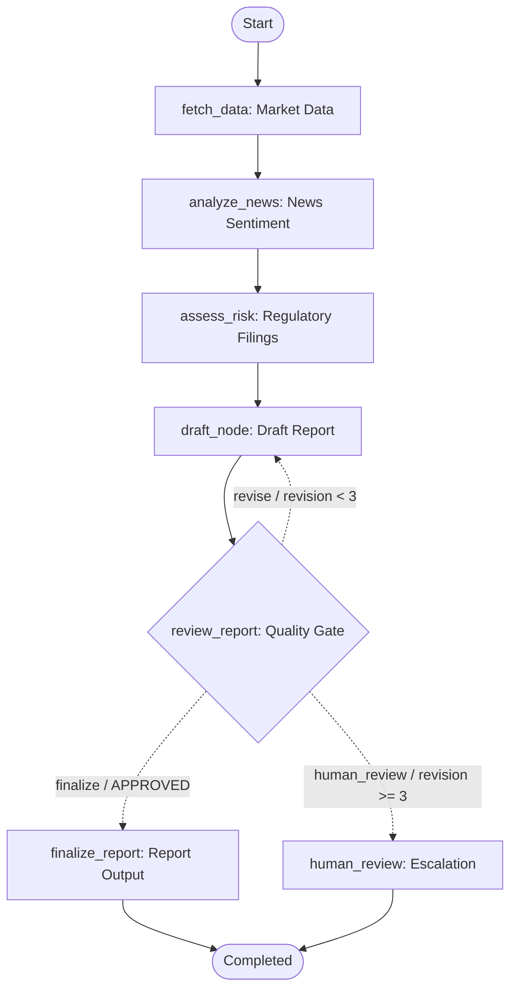

# Module 7: LangGraph & CrewAI Multi-Agent Workflows

This module provides two distinct paradigms for autonomous financial research:
1. **LangGraph Engine**: Deterministic, stateful graph orchestration with SQLite checkpointing, cyclical revision loops, and human-in-the-loop escalation.
2. **CrewAI Engine**: Role-based agent collaboration (Senior Analyst, Risk Officer, Market Intelligence, Executive Writer) with tool delegation and long-term memory.

---

## 1. LangGraph Workflow Architecture



### Key LangGraph Features
- **Deterministic Routing**: Conditional edge evaluates reviewer feedback and automatically triggers revisions or escalates to human review on repeated rejections (3rd attempt).
- **Persistent State Checkpointing**: Uses SQLite (`checkpoints.sqlite`) keyed by `thread_id` to allow resuming workflows seamlessly across sessions.
- **Mermaid Graph Export**: Automatically dumps compiled execution DAG to `artifacts/module_07/workflow.mmd`.

---

## 2. CrewAI Multi-Agent Team

- **Senior Financial Analyst**: Evaluates company financial performance and ratios.
- **Market Intelligence Specialist**: Analyzes news catalysts and market sentiment.
- **Risk & Compliance Officer**: Queries regulatory filings for material compliance risks.
- **Executive Report Writer**: Synthesizes inputs into a balanced, professional research brief.

---

## Running & Testing

### 1. Run Automated Unit Tests

From `module_07_langgraph_crewai`:

```powershell
$env:PYTHONPATH = "."
..\venv\Scripts\python -m pytest tests -v
```

### 2. Code Linting & Style Check

```powershell
..\venv\Scripts\python -m ruff check .
```

### 3. Run LangGraph Research Workflow

Execute the LangGraph workflow for a ticker (e.g. `AAPL`, `MSFT`, `TSLA`):

```powershell
$env:PYTHONPATH = "."
..\venv\Scripts\python -m src.main --engine langgraph --ticker AAPL
```

Outputs generated in `artifacts/module_07/`:
- `AAPL_langgraph.md`: Final synthesized research report.
- `checkpoints.sqlite`: SQLite state database with thread checkpoints.
- `workflow.mmd`: Compiled Mermaid workflow graph diagram.

### 4. Run CrewAI Research Workflow

```powershell
$env:PYTHONPATH = "."
..\venv\Scripts\python -m src.main --engine crewai --ticker AAPL
```

---

## Docker Support

Run containerized tests from the root directory:

```powershell
docker build -t module_07_agent -f module_07_langgraph_crewai/Dockerfile .
docker run --rm module_07_agent pytest -v
```
