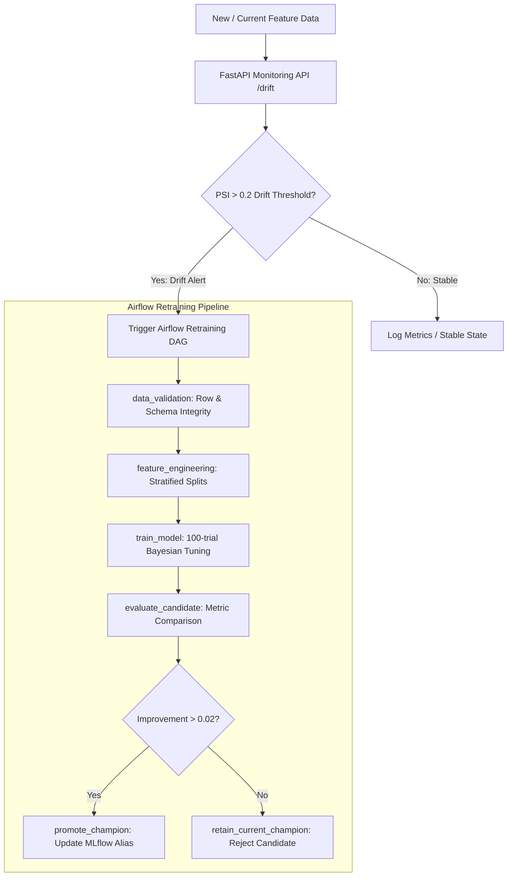

# Module 8: MLOps, Model Monitoring & Continuous Retraining

This module implements production-grade MLOps infrastructure for the SmartFinance platform:
1. **Population Stability Index (PSI) Monitoring**: Computes quantile-based PSI to detect distribution shifts across financial and credit risk features.
2. **Evidently Drift Reports**: Simulates 5 progressive distribution shift periods and generates visual HTML and structured JSON drift dashboards.
3. **Model Registry & Dynamic Promotion**: Enforces strict deployment criteria (requires $> 0.02$ absolute metric improvement) and manages `candidate` / `champion` aliases in MLflow.
4. **Airflow Automated Retraining DAG**: Orchestrates weekly scheduled data validation, feature engineering, 100-trial Bayesian tuning, and conditional model promotion.

---

## 1. Architecture & Workflow



---

## 2. API Endpoints

| Endpoint | Method | Purpose |
| :--- | :--- | :--- |
| `/health` | `GET` | Service liveness probe |
| `/drift` | `POST` | Calculates per-feature PSI, flags drifted features, and triggers Airflow |

---

## 3. Running & Testing

### 1. Run Automated Unit Tests
From `module_08_mlops`:

```powershell
python -m pytest tests -v
```

### 2. Start the Monitoring Service
```powershell
python -m uvicorn src.main:app --port 8004 --reload
```

### 3. Generate Evidently 5-Period Drift Reports
```powershell
python -c "import pandas as pd; from pathlib import Path; from src.evidently_reports import generate_five_periods; df = pd.read_csv('../data/processed/splits/credit_test.csv').select_dtypes(include='number').head(500); generate_five_periods(df, Path('../artifacts/module_08/evidently')); print('Generated 5 Evidently reports')"
```

### 4. Test Drift Endpoint (Sample Payload)
```powershell
$body = @{
    reference = @{ age = 20..60; income = (20..60 | ForEach-Object { $_ * 1000 }) }
    current   = @{ age = 20..60; income = (20..60 | ForEach-Object { $_ * 5000 + 20000 }) }
    threshold = 0.2
    trigger_retraining = $false
} | ConvertTo-Json

Invoke-RestMethod -Uri "http://127.0.0.1:8004/drift" -Method Post -Body $body -ContentType "application/json"
```
