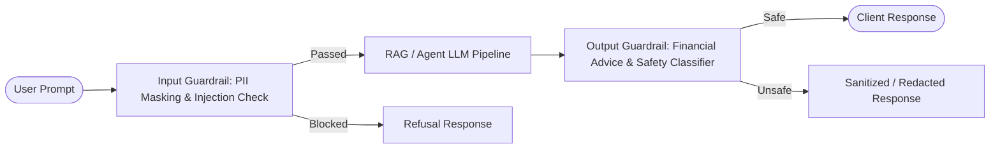

# Module 9: Security, Privacy & Ethical AI

This module implements comprehensive defenses, guardrails, and compliance audits for the SmartFinance AI Platform:
1. **Input Guardrails**: Prompt injection detection, system prompt leakage prevention, and automated structured PII masking (SSN, Email, Phone, Account Numbers).
2. **Output Guardrails**: Directive financial advice filtering and fast **Groq JSON-mode** secondary safety classification with offline deterministic fallback.
3. **Automated Red Team Suite**: 15 attack prompts testing direct injections, indirect document attacks, role-playing jailbreaks, and leveraged financial advice requests.
4. **Differential Privacy**: `diffprivlib` privacy-preserving logistic regression comparison ($\varepsilon=1.0$).
5. **Fairness & Bias Audit**: `fairlearn` demographic parity, equalized odds, and ExponentiatedGradient fairness mitigation across customer age cohorts.

---

## 1. Multi-Layer Guardrail Architecture



---

## 2. API Endpoints

| Endpoint | Method | Purpose |
| :--- | :--- | :--- |
| `/health` | `GET` | Service liveness probe |
| `/guard` | `POST` | Inspects input/output against injection patterns, financial advice, and safety rules |
| `/anonymize` | `POST` | Redacts structured PII from financial text |
| `/explain` | `POST` | Formats plain-language adverse action / approval notices based on feature attribution weights |

---

## 3. Running & Testing

### 1. Run Automated Unit Tests
From `module_09_security_ethics`:

```powershell
python -m pytest tests -v
```

### 2. Start the Security & Guardrails Service
```powershell
python -m uvicorn src.main:app --port 8000 --reload
```

### 3. Run the Red Team Attack Suite
```powershell
python -m src.redteam --endpoint "http://127.0.0.1:8000/guard" --output "..\artifacts\module_09_redteam.json" --guarded
```

### 4. Run Differential Privacy & Fairness Audits
```powershell
python -c "from pathlib import Path; from src.privacy import compare_differential_privacy; from src.ethics.fairness_audit import train_fair_models; dp = compare_differential_privacy(Path('../data/processed/splits/credit_train.csv'), Path('../data/processed/splits/credit_test.csv'), epsilon=1.0); print('Differential Privacy:', dp); fair = train_fair_models(Path('../data/processed/splits/credit_train.csv'), Path('../data/processed/splits/credit_test.csv'), Path('../artifacts/fairness_curve.png')); print('Fairness Audit:', fair)"
```
